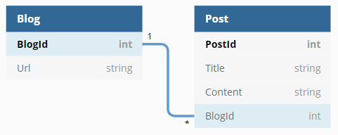

# EF Core SQLite Demo

.NET Core 3 console application using Entity Framework code first against an SQLite database.

Inspired by this article: https://docs.microsoft.com/en-us/ef/core/get-started/?tabs=netcore-cli

## Database Model

The database consists of two tables: Blog and Post. A blog contains zero or more posts.

*Diagram made with https://dbdiagram.io*

## Docker

To create a Docker image:

    dotnet publish -c Release

    docker build -t sqlite-demo .

    docker run -it -e ConnectionStrings__SQLite="Data Source=/database/blogging.db" -v "C:/temp/database:/database" sqlite-demo